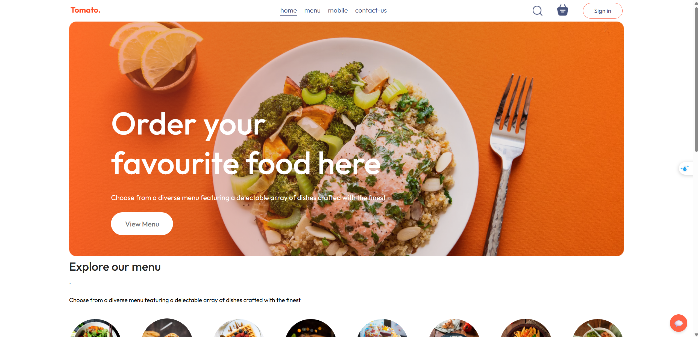

# Food Delivery Web Application


This is a full-stack online food ordering web application, including a **Backend** (Node.js, Express, MongoDB, Socket.IO) and a **Frontend** (React, Vite). The app allows users to browse food, manage their cart, place orders, pay via Stripe, track orders, and includes an admin management system with real-time chat support.

---

## 🚀 Main Features

### User

- Register, login, and JWT authentication.
- Browse food menu, search, and filter by category.
- Add/remove food items to/from cart.
- Place orders and enter delivery information.
- Online payment via Stripe.
- View personal order history.
- **Real-time chat with admin (WebSocket, Socket.IO).**

### Admin

- Login with admin privileges.
- Manage food menu (add, edit, delete).
- View and manage all orders.
- Manage users.
- **Chat with users in real-time (WebSocket, Socket.IO).**

---

## ⚙️ Setup Guide

### 1. Backend

- Install dependencies:
  ```bash
  cd backend
  npm install
  ```
- Create a `.env` file with the following content:
  ```
  PORT=4000
  MONGO_URI=your_mongodb_uri
  JWT_SECRET=your_jwt_secret
  STRIPE_SECRET_KEY=your_stripe_secret_key
  ```
- Start the server:
  ```bash
  npm run server
  ```

### 2. Frontend

- Install dependencies:
  ```bash
  cd frontend
  npm install
  ```
- Start the app:
  ```bash
  npm run dev
  ```

---

## 💬 WebSocket (Real-time Chat) Guide

- **Technology:** Socket.IO (Node.js backend & React frontend)
- **Authentication:** Only logged-in users (via JWT) can use chat.
- **How it works:**
  - After login, the frontend connects to the backend Socket.IO server and authenticates using the JWT token.
  - Users and admin can send/receive private messages in real-time.
  - Each user joins a private room based on their username or user ID.
  - The backend verifies the JWT token before allowing chat actions.

---

## 🔗 Key API Endpoints

- `POST /api/user/login` — Login
- `POST /api/user/register` — Register
- `POST /api/cart/add` — Add to cart
- `POST /api/order/place` — Place order
- `POST /api/order/verify` — Verify payment
- `POST /api/order/status` — Update order status
- `POST /api/order/userorders` — Get user's orders
- `GET /api/order/list` — Get all orders (admin)
- `GET /api/food/list` — Get food list

---

## 🛠️ Technologies Used

- **Backend:** Node.js, Express, MongoDB, Mongoose, JWT, Stripe, Multer, Socket.IO
- **Frontend:** React, Vite, Axios, React Router, Context API, Socket.IO-client

---

## 📌 Notes

- Food images are stored in `backend/uploads`
- Stripe requires correct key and callback URL configuration
- To access admin pages, the account must have `isAdmin: true`
- Make sure both backend and frontend are running for the system to work properly
- For chat, users must be logged in to use the real-time messaging feature

---
